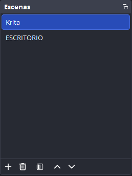
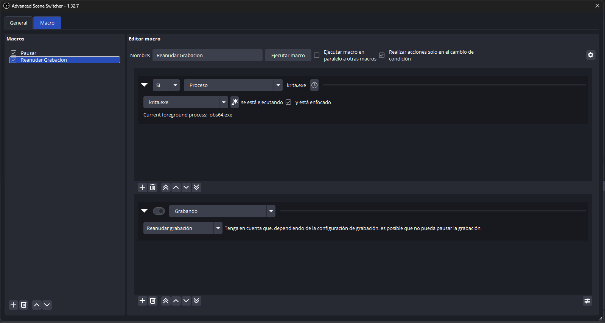

# 🎨 Krita + OBS: One-Click Art Mode
Este repositorio ofrece una solución sencilla para automatizar el inicio de Krita y OBS Studio con grabación inteligente. Está diseñado para artistas que desean documentar su proceso sin preocuparse por la gestión manual de la grabación o la edición posterior de fragmentos inactivos.

## 🚀 Características principales
__Lanzamiento dual:__ Abre Krita y OBS simultáneamente con un solo clic.

__Grabación automática:__ OBS inicia minimizado en la bandeja del sistema y comienza a grabar de inmediato en la escena correcta.

__Pausa inteligente:__ La grabación se detiene automáticamente si sales de Krita (para buscar referencias o navegar) y se reanuda al volver al lienzo, ahorrando espacio en disco.

__Estética limpia:__ Incluye un script invisible para evitar la ventana negra de la consola de Windows y un icono personalizado para tu escritorio.

## 🛠️ Requisitos previos
__OBS Studio instalado.__

__Plugin Advanced Scene Switcher__ (probado en v1.32.7).

## 📥 Instalación y Configuración
__1. Preparar los archivos__
Descarga de este repositorio los archivos Krita+OBS.bat, LanzadorInvisible.vbs y colócalo en una carpeta segura (ejemplo: D:\KRITA+OBS\).

[!IMPORTANT] Ajuste de rutas: Debes editar el archivo Krita+OBS.bat con el Bloc de notas. Cambia las rutas actuales (D:\...) por las carpetas exactas donde tengas instalado Krita y OBS en tu PC.

__2. Configuración en OBS__
Para que los scripts funcionen, tu OBS debe estar configurado así:

__Escena:__ Crea una escena llamada exactamente Krita.

__Fuente:__ Agrega una "Captura de ventana" (apuntando a krita.exe) o "Captura de pantalla" dentro de esa escena.

.png)

__3. Automatización de macros__
Abre __Advanced Scene Switcher__ y configura estas dos macros basadas en Procesos:

Macro __"Reanudar"__: SI el proceso krita.exe está ejecutándose y enfocado ➡️ Reanudar grabación.

Macro __"Pausar"__: SI el proceso krita.exe NO está enfocado ➡️ Pausar grabación.

## 🚀 Guía de uso
__Crea un acceso directo del archivo LanzadorInvisible.vbs en tu escritorio.__

__Haz clic derecho -> Propiedades -> Cambiar icono y selecciona el archivo .ico incluido en este repo, que puedes descargar.__

# ¡Listo! De ahora en adelante, solo haz doble clic en ese icono para empezar a crear.

# ⚖️ Licencia
# Este proyecto no tiene una licencia formal adjunta. Es de uso libre para la comunidad de artistas. Puedes copiarlo, modificarlo y compartirlo según tus necesidades.
